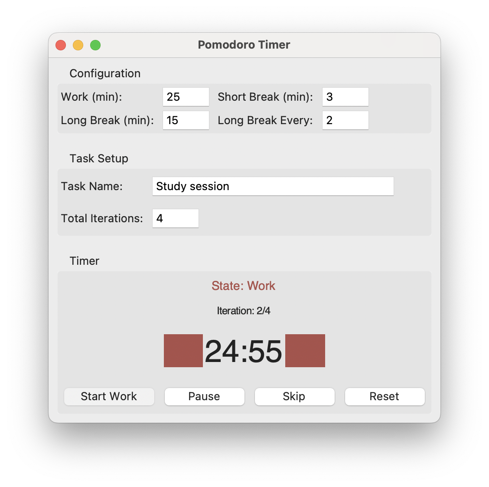

# Pomodoro Timer



This is a simple **Pomodoro Timer** built with **Python and Tkinter**, designed to run as a standalone desktop application on **macOS, Windows, and Linux**.

The app helps you stay productive even in disconnected environment where you work in focused sessions with short and long breaks.

## **Features**
✅ **Customizable Work and Break Durations** – Set your work session, short break, and long break times.  
✅ **Auto-Saving Settings** – Configuration values save automatically when changed.  
✅ **Task Management** – Set a task name and define the number of Pomodoro cycles.  
✅ **Manual Start** – Work sessions start manually, while breaks begin automatically.  
✅ **Pause & Resume** – Pause the timer anytime and resume from where you left off.  
✅ **Skip Current Session** – Skip a work session or break, transitioning to the next phase instantly.  
✅ **Reset Timer** – Reset the timer and task progress to start fresh.  
✅ **Iteration Tracking** – Shows your current work session progress.  

---

## Installation
### 1. Clone the Repository
```sh
git clone https://github.com/naubull2/pypomo-focus.git
cd pypomo-focus
```

### 2. Install Dependencies
Ensure you have **Python 3** installed on your system. This app uses only built-in libraries, so no additional dependencies are needed.


## Usage
### Run the Application
Execute the script with:
```sh
python pomo_timer.py
```

### How to Use
1. **Set your work/break durations** – Adjust timer values in the configuration section.
2. **Enter a task name** – Define the task you’ll be working on.
3. **Set the number of iterations** – Choose how many Pomodoro cycles you want to complete.
4. **Click "Start Work"** – Begin your first work session.
5. **Auto-starting breaks** – After each work session, short breaks begin automatically.
6. **Skip a session** – Click **Skip** to move to the next phase instantly.
7. **Pause the timer** – Click **Pause** to temporarily stop the countdown, and **Resume** to continue.
8. **Reset if needed** – Click **Reset** to restart with the current configuration.

---

## License
This project is open-source and available under the MIT License.


## Contributing
If you have suggestions or improvements, feel free to fork this repo and submit a pull request!

